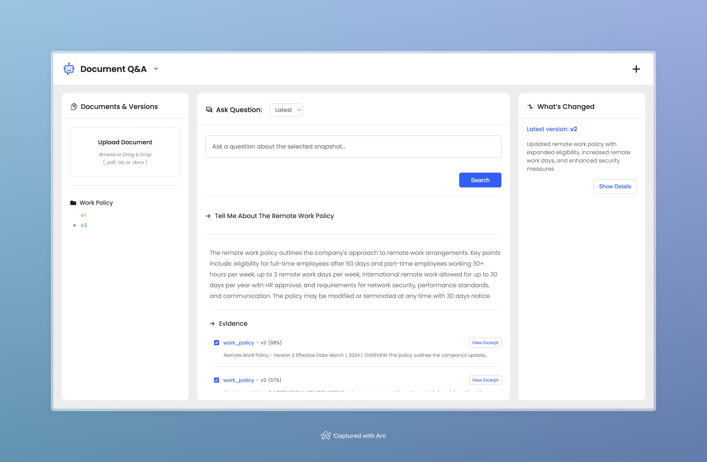
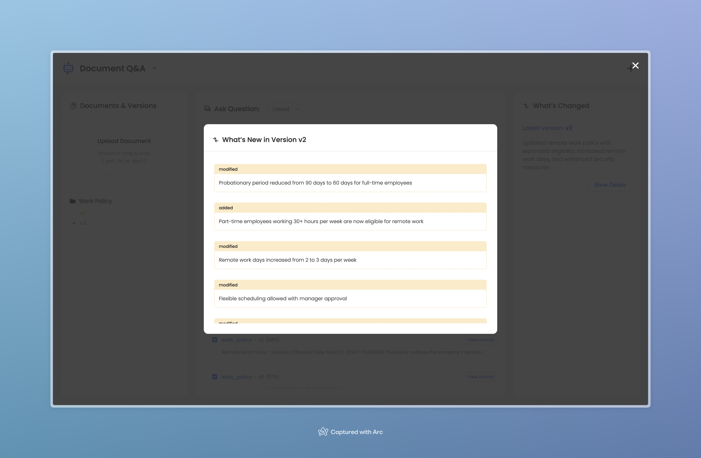
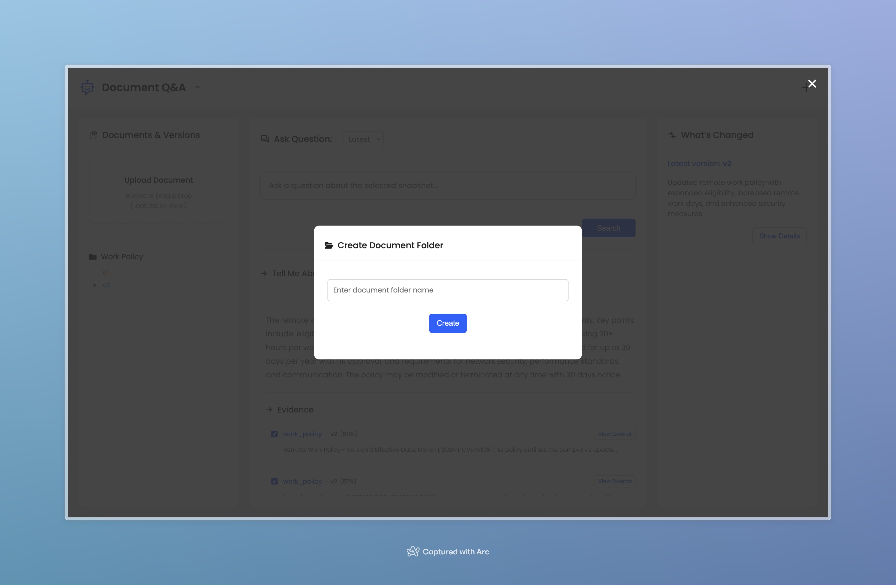

# Multi-Version Document Q&A with RAG

A RAG system with built-in version control enabling semantic search and natural language Q&A across document revision history.

[](https://www.sivasanker.com/projects/document-qa-rag)








## Overview

Solves document version tracking by implementing version-aware semantic search. Unlike traditional RAG systems that only support current versions, this system maintains complete document history with temporal querying capabilities.

### Key Features

- **Version Control:** Query any historical version ("What did v3 say about remote work?")
- **Temporal Comparison:** Compare any two versions with automated change detection
- **Incremental Indexing:** O(1) version additions without index rebuilds
- **LLM Integration:** Natural language answers via Llama 3.3-70B (Groq API)
- **Change Detection:** Automatic classification of modified/added/removed content

---

## Tech Stack

- **Backend:** FastAPI, FAISS, Sentence Transformers, SQLAlchemy, Groq API
- **Frontend:** React
- **Deployment:** Hugging Face Spaces (backend API), Vercel (frontend)
- **Containerization:** Docker

---

## Architecture

```
React Frontend (Vercel)
    ↓ HTTPS
FastAPI Backend (Hugging Face Spaces / Docker)
    ↓
[SQLite] [FAISS Index] [Groq LLM]
```

### Core Components

1. **Document Processor:** Extracts text, chunks (512 chars, 50 overlap)
2. **Embeddings:** Sentence Transformers (all-MiniLM-L6-v2, 384 dims)
3. **Vector Store:** FAISS with incremental indexing
4. **Version Metadata:** SQLAlchemy ORM (Document, Version, Chunk tables)
5. **LLM Integration:** Groq API for answer generation

---

## Installation

### Backend Setup (Local)

```bash
cd server
python -m venv .venv
source .venv/bin/activate
pip install -r requirements.txt

export GROQ_API_KEY=YOUR_GROQ_API_KEY

python server_app.py
```

Runs at `http://localhost:8000`

### Frontend Setup

```bash
cd ui
npm install
npm start
```

Runs at `http://localhost:3000`

---

## API Endpoints

### Upload Document

```bash
POST /api/documents/upload
Content-Type: multipart/form-data

file: [PDF/TXT/DOCX]
doc_name: "policy"
```

### Query

```bash
POST /api/query/generate
{
  "question": "What is the remote work policy?",
  "version_id": 2,
  "k": 5
}
```

### Compare Versions

```bash
POST /api/compare/detailed
{
  "question": "What changed?",
  "version_id_1": 1,
  "version_id_2": 2
}
```

### List Versions

```bash
GET /api/documents/{doc_name}/versions
```

---

## How It Works

### 1. Document Upload

- Extract text (PyPDF, python-docx)
- Chunk text (512 chars, 50 overlap)
- Generate embeddings (Sentence Transformers)
- Store in FAISS (incremental add) + SQLite (metadata)

### 2. Query

- Generate question embedding
- FAISS similarity search (filter by version_id)
- LLM generates answer from retrieved chunks

### 3. Version Comparison

- Query both versions
- Calculate chunk-level cosine similarity
- Classify changes (modified/added/removed)
- LLM summarizes differences

---

## Project Structure

```
├── server/
│   ├── src/
│   │   ├── database.py           # SQLAlchemy models
│   │   ├── embeddings.py         # Sentence Transformers wrapper
│   │   ├── vector_store.py       # FAISS operations
│   │   ├── document_processor.py # Text extraction & chunking
│   │   └── rag_system.py         # Main orchestrator
│   ├── server_app.py             # FastAPI application
│   └── requirements.txt
│
└── ui/
    ├── public/
    ├── src/
    │   └── components/
    │   ├── App.js
    │   ├── config.js
    │   ├── index.js
    └── package.json
```

---

## Deployment

### Hugging Face Spaces (Backend)

This project is deployed on **Hugging Face Spaces** using the **Docker Space SDK** on the free CPU tier.

**Space URL:** https://technophyle-doc-qa.hf.space/

**Deployment details**

- **Space SDK:** Docker
- **Runtime:** FastAPI (Uvicorn)
- **Containerization:** Docker
- **Hardware:** Free CPU

**Required environment variables:** GROQ_API_KEY

### Vercel (Frontend)

```
Framework: React
```

---

## Use Cases

- **Policy Tracking:** Track changes in HR policies, contracts, regulations
- **Compliance:** Audit document revisions with searchable history
- **Legal:** Compare contract versions, track amendments
- **Knowledge Management:** Maintain evolving documentation with temporal queries

---
